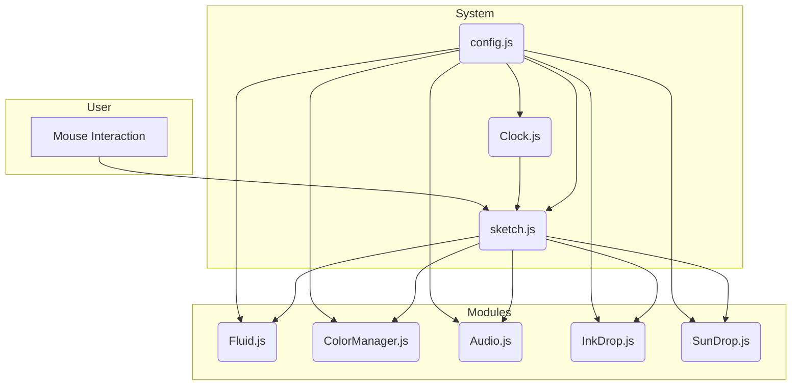

# 00. Architecture and Data Flow

## 1. System Overview

Ephemeral Time is composed of seven core modules, one configuration file, and `sketch.js`, which orchestrates them all. Each module has an independent function, and `sketch.js` acts as the conductor, coordinating the data flow between them.

## 2. Data Flow

1.  **Initialization (`setup`)**:
    -   `sketch.js` references `config.js` to initialize all modules (`Clock`, `Fluid`, `ColorManager`, etc.).
    -   It registers listeners for time events (`second`, `minute`, `hour`, `chime`) on `Clock.js`.

2.  **Main Loop (`draw`)**:
    -   **Time Update**: `Clock.js`'s `update()` is called, checking the current time. If a change is detected, it emits the registered events.
    -   **Event Handling**: `sketch.js` receives events from `Clock.js` and calls `create...Drop()` functions to generate new `InkDrop` objects.
    -   **State Update**:
        -   The user's mouse movement is detected via `mouseDragged()` and adds **Turbulence** to `Fluid.js`.
        -   `Fluid.js` internally decays the turbulence value over time.
        -   `sketch.js` gets the current turbulence value from `Fluid.js` and passes it to `ColorManager.js` and `Audio.js` to adjust colors and sound.
    -   **Rendering**:
        -   Inside the `updateAndRenderDrops()` function, all `InkDrop` objects in the `activeDrops` array are updated and drawn.
        -   Each `InkDrop` gets the fluid vector (flow) from `Fluid.js` at its position and the repulsion force from `SunDrop.js` to update its position.
        -   All drops are drawn onto the `activeLayer`.

## 3. Rendering Pipeline

For performance optimization, the project uses three graphics layers (`p5.Graphics`).

1.  **`bgLayer` (Background Layer)**:
    -   Positioned at the very bottom, it draws a solid, unchanging background.
    -   It doesn't need to be redrawn every frame, reducing performance load.

2.  **`historyLayer` (History Layer)**:
    -   When an `InkDrop`'s lifespan ends, its final trace ("stain") is stamped onto this layer.
    -   It manages the accumulated traces over time.
    -   It is only cleared when `resetCanvasForNewHour()` is called.

3.  **`activeLayer` (Active Layer)**:
    -   This is the layer where all currently "alive" `InkDrop` and `SunDrop` objects are drawn.
    -   **It is completely cleared and redrawn every frame.** This allows for dynamic movement.

**Final Rendering Order**: At the end of the `draw()` function, the layers are drawn onto the canvas in the order `image(bgLayer)`, `image(historyLayer)`, `image(activeLayer)` to compose the final screen. Thanks to this structure, performance is maintained even with hundreds of 'stains' because only a few active drops need to be recalculated.

---

# 00. 아키텍처 및 데이터 흐름

## 1. 시스템 개요

Ephemeral Time은 7개의 핵심 모듈과 1개의 설정 파일, 그리고 이들을 총괄하는 `sketch.js`로 구성됩니다. 각 모듈은 독립적인 기능을 수행하며, `sketch.js`는 이들 사이의 데이터 흐름을 조율하는 오케스트레이터 역할을 합니다.

## 2. 데이터 흐름 (Data Flow)

1.  **초기화 (`setup`)**:
    -   `sketch.js`는 `config.js`를 참조하여 모든 모듈(`Clock`, `Fluid`, `ColorManager` 등)을 초기화합니다.
    -   `Clock.js`에 시간 이벤트(`second`, `minute`, `hour`, `chime`) 리스너를 등록합니다.

2.  **메인 루프 (`draw`)**:
    -   **시간 업데이트**: `Clock.js`의 `update()`가 호출되어 현재 시간을 확인하고, 시간의 변화가 감지되면 등록된 이벤트를 발생시킵니다.
    -   **이벤트 처리**: `sketch.js`는 `Clock.js`로부터 받은 이벤트를 바탕으로 `create...Drop()` 함수들을 호출하여 새로운 `InkDrop` 객체를 생성합니다.
    -   **상태 업데이트**:
        -   사용자의 마우스 움직임은 `mouseDragged()`를 통해 감지되어 `Fluid.js`에 **Turbulence(난기류)**를 추가합니다.
        -   `Fluid.js`는 내부적으로 난기류 값을 시간에 따라 감소시킵니다.
        -   `sketch.js`는 `Fluid.js`에서 현재 난기류 값을 가져와 `ColorManager.js`와 `Audio.js`에 전달하여 색상과 소리를 조절합니다.
    -   **렌더링**:
        -   `updateAndRenderDrops()` 함수 내에서 모든 `activeDrops` 배열의 `InkDrop` 객체들이 업데이트되고 그려집니다.
        -   이때 각 `InkDrop`은 `Fluid.js`로부터 자신의 위치에 해당하는 유체 벡터(흐름)와 `SunDrop.js`로부터의 반발력을 받아 위치를 갱신합니다.
        -   모든 드롭은 `activeLayer`에 그려집니다.

## 3. 렌더링 파이프라인 (Rendering Pipeline)

성능 최적화를 위해 3개의 그래픽 레이어(`p5.Graphics`)를 사용합니다.

1.  **`bgLayer` (배경 레이어)**:
    -   가장 아래에 위치하며, 변화가 없는 단색 배경을 그립니다.
    -   매 프레임 다시 그릴 필요가 없어 성능 부하를 줄입니다.

2.  **`historyLayer` (기록 레이어)**:
    -   `InkDrop`이 수명을 다하면, 그 마지막 흔적("얼룩")이 이 레이어에 찍힙니다.
    -   시간이 지나며 쌓이는 흔적들을 관리합니다.
    -   `resetCanvasForNewHour()`가 호출될 때만 초기화됩니다.

3.  **`activeLayer` (활성 레이어)**:
    -   현재 살아있는 모든 `InkDrop`과 `SunDrop`이 그려지는 레이어입니다.
    -   **매 프레임 완전히 지워지고 다시 그려집니다.** 이를 통해 동적인 움직임을 표현합니다.

**최종 렌더링 순서**: `draw()` 함수의 마지막에 `image(bgLayer)`, `image(historyLayer)`, `image(activeLayer)` 순서로 캔버스에 겹쳐 그려 최종 화면을 완성합니다. 이 구조 덕분에 수백 개의 '얼룩'이 있어도 활성 드롭 몇 개만 다시 계산하므로 성능이 유지됩니다.
